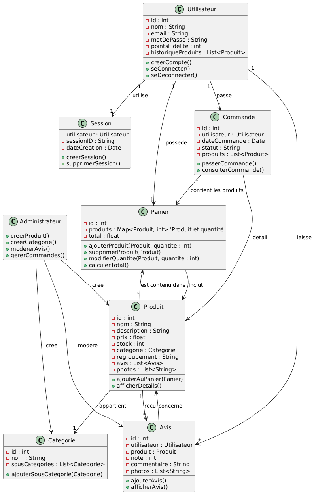
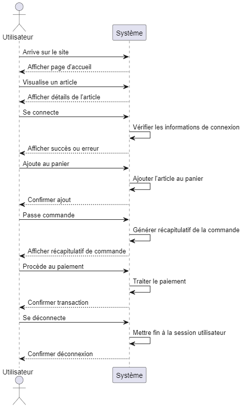

= Document de Conception

:toc:
:icons: font
:numbered:

Ce document de conception présente le développement d'un site de commerce en ligne, dont l’objectif est de vendre des répliques d’objets divers à l’échelle 1/1, allant de voitures de collection à des appareils électroménagers.

== Diagramme de Classe Métier

Le diagramme de classe ci-dessous représente les principales entités du système ainsi que leurs relations. Il détaille les attributs et méthodes associés à chaque classe, offrant une vue d'ensemble de la structure et des responsabilités de chaque composant métier.

* **Utilisateur** : Classe principale représentant un utilisateur du système avec des attributs comme `id`, `nom`, `email`, et `pointsFidelite`. Il peut `seConnecter`, `seDeconnecter`, et `creerCompte`.
* **Administrateur** : représentant un administrateur qui peut `creerProduit`, `creerCategorie`, `modererAvis` et `gererCommandes` 
* **Session** : Gère les informations de session d'un utilisateur, avec la possibilité de `creerSession` et `supprimerSession`.
* **Commande** : Contient les détails d'une commande passée par l'utilisateur, incluant la date et le statut, et peut `passerCommande` et `consulterCommande`.
* **Panier** : Permet la gestion du panier de l'utilisateur, incluant l'ajout, suppression, et modification de produits, ainsi que le calcul du total.
* **Produit** : Définit les caractéristiques d'un produit (prix, stock, catégorie, etc.) et les actions associées comme `ajouterAuPanier`.
* **Categorie** : Structure les produits en différentes catégories et sous-catégories.
* **Avis** : Permet à l'utilisateur de laisser un avis sur un produit.

== Diagramme de Séquence Système

Le diagramme de séquence ci-dessous illustre le déroulement des interactions entre l'utilisateur et le système pour un parcours typique d'achat. Il montre les étapes principales de la connexion au site, l'ajout d'articles au panier, la confirmation de commande et la déconnexion.

* **Afficher la page d'accueil** : L'utilisateur arrive sur le site et le système lui présente la page d'accueil.
* **Visualiser un article** : L'utilisateur explore un article, et le système affiche les détails.
* **Connexion** : L'utilisateur se connecte, le système vérifie les informations de connexion.
* **Ajouter au panier** : L'utilisateur ajoute un article au panier, le système confirme l'ajout.
* **Passer commande** : L'utilisateur passe commande, le système génère un récapitulatif.
* **Paiement** : L'utilisateur procède au paiement, que le système traite.
* **Déconnexion** : L'utilisateur se déconnecte, et le système met fin à la session.

== Diagrammes des cas d'utilisation

